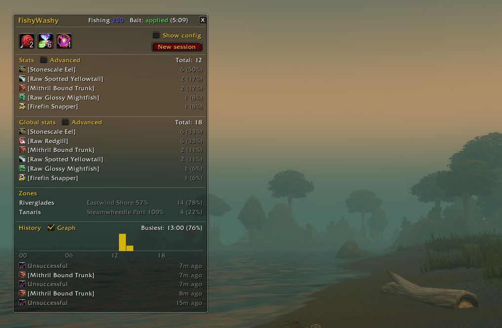
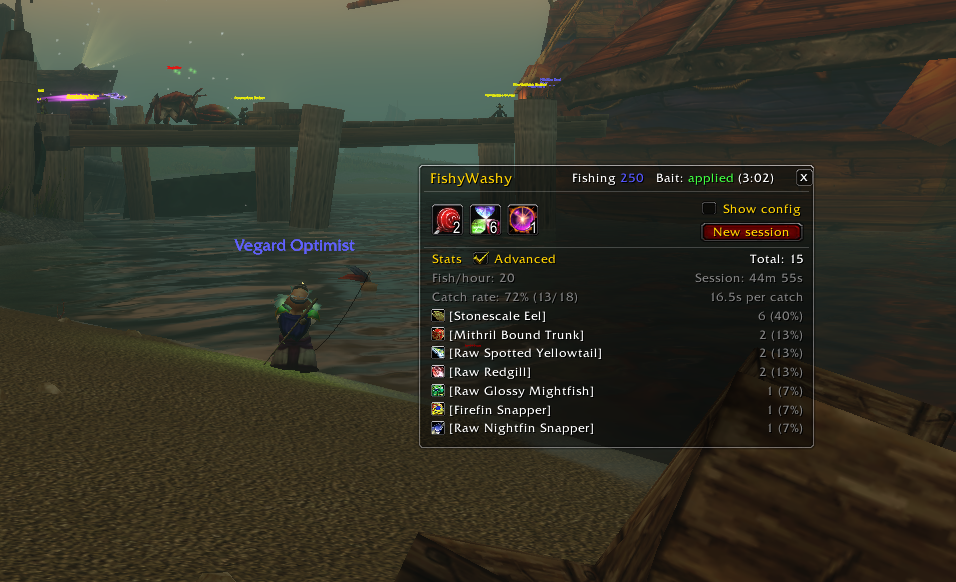
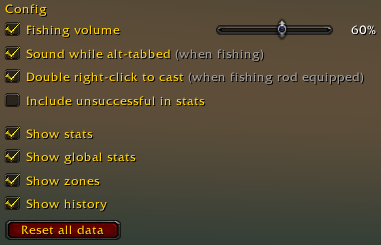

# FishyWashy

A small World of Warcraft Classic fishing addon.

- Boosts the volume while fishing so the bobber splash is easy to hear
- Shows bait status and buttons to apply bait from your bags
- Double right-click to cast Fishing (optional)
- Session and all-time stats: catches, catch rate, zones and when you fish

The window shows automatically when a fishing pole is equipped. `/fishy` toggles it.

## Configurable

Show only the panels you want, turn on advanced stats, and tune the sound.

