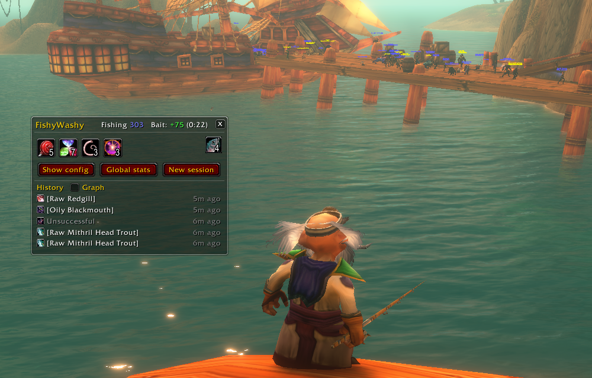
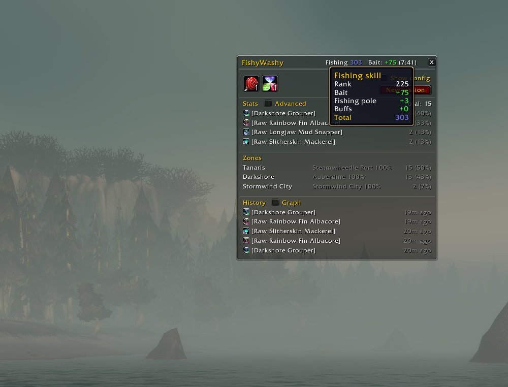
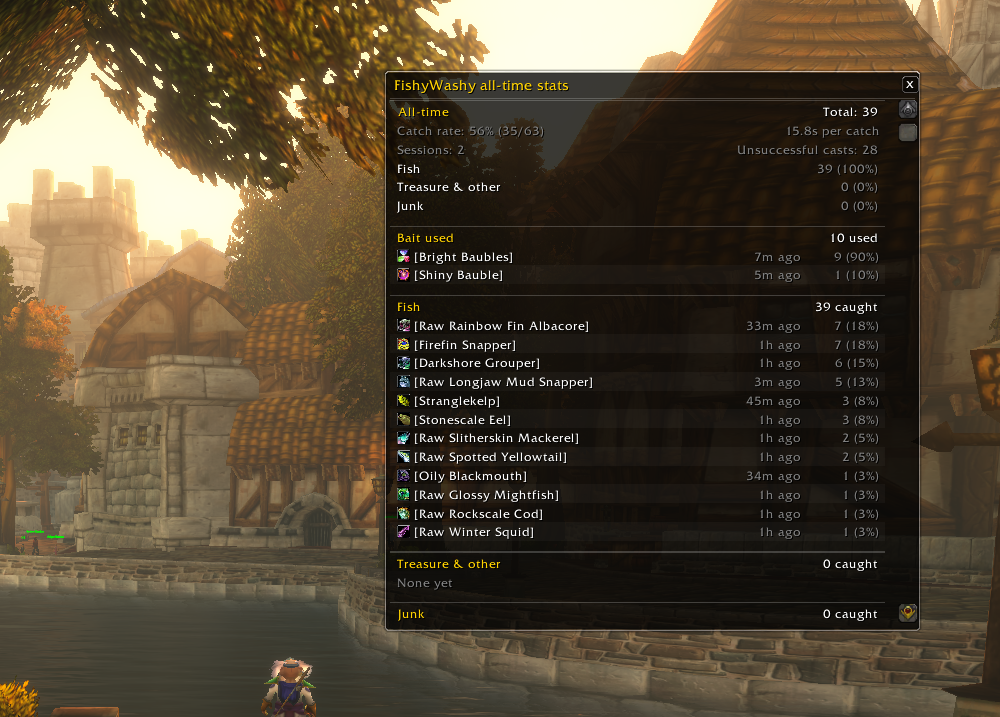

# FishyWashy

A small World of Warcraft Classic fishing addon.

- Boosts the volume while fishing so the bobber splash is easy to hear
- Shows your total fishing skill and bait status
- Apply bait and food buffs from your bags with a click
- Double right-click to cast Fishing
- Session and all-time stats: catches, catch rate, zones and when you fish

The window shows automatically when a fishing pole is equipped. `/fishy` toggles it.

## Configurable

Show only the panels you want, turn on advanced stats, and tune the sound.

## Fishing skill

Hover the fishing skill to see where it comes from: rank, bait, gear and buffs.

## Global stats

The Global stats button opens all-time stats: bait used, everything caught grouped into fish, treasure and junk, and a loot table for each zone and area. Share your stats or your fishing skill in chat with the buttons at the top.

## Changelog

See [CHANGELOG.md](CHANGELOG.md).
